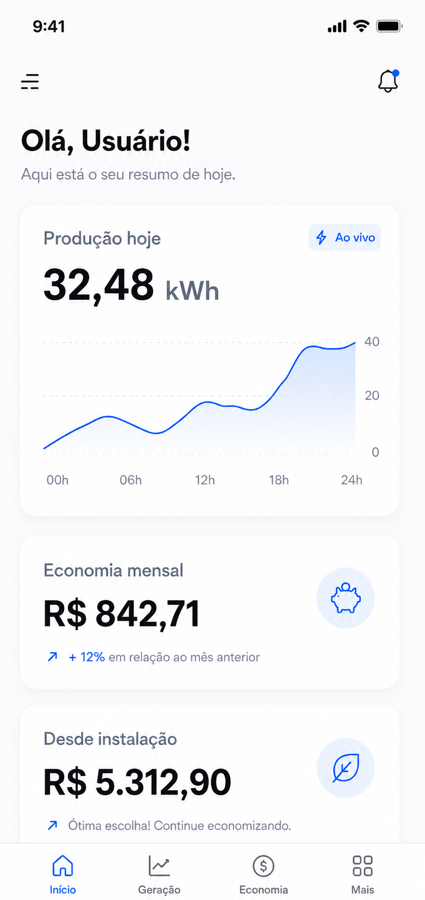

<div align="center">
	
</div>

# Lumina Tech Solar

**Economize até 95% na conta de luz com energia solar inteligente!**

Lumina Tech Solar é um ecossistema digital interativo voltado para a conscientização, simulação e conversão de clientes interessados em transicionar para fontes de energia limpa. A plataforma combina uma experiência visual fluida (UX) com ferramentas dinâmicas de engenharia financeira para o setor solar.

## 🚀 Funcionalidades e Engenharia de UX

- **Simulação de Economia (US01 Visitante):** Calculadora de ROI integrada a componentes numéricos e deslizantes (Sliders) em tempo real, projetando o retorno financeiro exato sobre a conta de luz.
- **Modo Sustentável (US02 Visitante):** Alternador de tema (*Dark Mode Toggle*) integrado de maneira global via classes injetadas dinamicamente no `html` e persistidas localmente através de `localStorage`.
- **Validação de Leads Inteligente (US03 Lead):** Mecanismos reativos de sanitização de dados, aplicando máscaras dinâmicas de formatação telefônica padrão `(XX) XXXXX-XXXX` e validações de e-mail via Expressões Regulares (Regex) antes da submissão do formulário.
- **Diferenciais Técnicos (US04 Visitante):** Painel expansível de alta fidelidade visual (Acordeão) que gerencia as aberturas de forma exclusiva através do cálculo de `scrollHeight` nativo via JavaScript, provendo transições limpas e sem trancos visuais.
- **Depoimentos Reais:** Histórias de sucesso de clientes residenciais e comerciais com comprovação de redução de gastos.

## 🏆 Destaques Comerciais
- 500+ projetos instalados
- R$ 2 milhões economizados por clientes
- 98% de satisfação
- Monitoramento 24/7

## 💡 Benefícios do Sistema
- 💰 **Economia Inteligente**: Reduza sua conta com alta performance energética.
- 🛡️ **Instalação Segura**: Equipe especializada e equipamentos de última geração homologados.
- 📱 **Gestão pelo App**: Monitore sua produção diária em tempo real diretamente pelo celular.
- 🌱 **Sustentabilidade**: Redução imediata da pegada de carbono usando energia limpa.

## 🔎 Como funciona o processo?
1. **Solicite o orçamento**: Preencha o formulário otimizado em menos de 2 minutos.
2. **Aprovação e Instalação**: Engenharia ágil com instalação finalizada em até 3 dias úteis após a aprovação técnica.
3. **Monitore e Economize**: Ative seu sistema, acompanhe a geração pelo aplicativo e veja sua economia crescer.

## 🗣️ Depoimentos em Destaque
> "Minha conta era R$780 por mês. Hoje pago R$58 de taxa mínima. O app da Lumina é incrível!" — Poliana Possenti

> "Minha barbearia tinha uma conta de R$4.200/mês. Com o sistema da Lumina, caiu para R$380." — Carlos Xavier

> "A Lumina me passou toda a documentação, laudos e certificações antes mesmo de fechar. Profissionalismo do início ao fim." — Gabriel Tartari

## 📋 Como usar e Executar Localmente
1. Baixe o pacote compactado do projeto (`.zip`) enviado pelo Google Drive e extraia-o em sua máquina.
2. Certifique-se de que a estrutura modular de arquivos está unificada na mesma pasta raiz.
3. Dê um duplo clique no arquivo `index.html` para iniciar a aplicação instantaneamente em qualquer navegador moderno.

## 📁 Estrutura Arquitetural do Projeto
```text
lumina-tech-solar/
├── Javacript/
│   └── script.js          # Lógica computacional, regras de negócio e eventos de UX
├── media/
│   ├── app.png            # Ativos visuais, imagens de depoimentos e logotipos
│   ├── carlos3.png
│   ├── fatura.png
│   ├── gabriel.jpg
│   ├── image.jpg
│   └── logo.png
├── style/
│   ├── calculadora.css    # Layouts e estilizações focadas no simulador de ROI
│   ├── darkmode.css       # Sobrescrita de escopo de variáveis CSS (:root) para o Modo Escuro
│   └── style.css          # Estilos estruturais globais, tipografia e seções institucionais
├── index.html             # Arquivo mestre estrutural com marcações semânticas HTML5
└── README.md              # Documentação técnica e manual do projeto

## 🤝 Contato
- Telefone: (47) 3000-1234
- E-mail: contato@lumina.com.br
- CNPJ: 12.345.678/0001-01

---

> Energia solar inteligente para um futuro sustentável.
